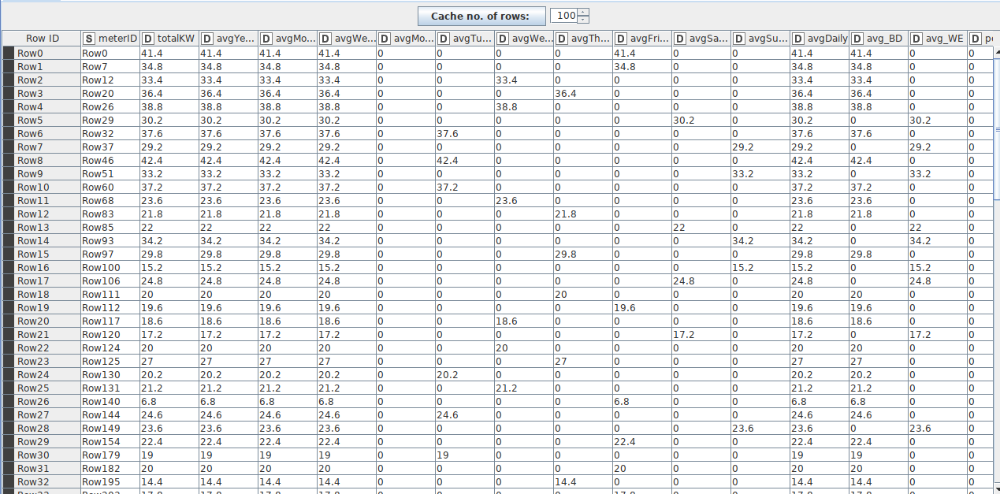

# Daily Minimum Temperatures

Fadhil Musaad

05111740000116

## Business Understanding

Data ini berupa data temperature terendah dalam jangka waktu tertentu yang didalamnya terdapat informasi sehingga dapat dilakukan peng-cluster-an dengan tujuan memberikan informasi yang berguna.

## Data Understanding

Data ini memiliki 2 kolom yang berisi:
1. Date - Berupa string yang berisi informasi waktu record
2. Daily Minimum Temperature - Berupa floating point yang berisi informasi temperature terendah pada Date yang bersesuaian 

## Data Preparation

Data dapat diunduh di [Kaggle](https://www.kaggle.com/shenba/time-series-datasets). 
Sebelum melakukan modeling, perlu dilakukan evaluasi data floating point yang memiliki error sehingga data yang telah dinormalisasi menjadi seperti yang tertera pada github ini.

## Modeling

- Unduh [Workflow Time-Series](https://hub.knime.com/knime/spaces/Examples/latest/10_Big_Data/02_Spark_Executor/09_Big_Data_Irish_Meter_on_Spark_only)-nya terlebih dahulu

* Pertama-tama data akan dibaca oleh node File Reader, arahkan path ke csv yang tertera
* Pada file reader, ubah nama kolom Date menjadi enc_datetime dan kolom Daily Minimum Temperature menjadi reading agar sesuai dengan workflow yang telah diunduh 

* Lalu kita menyiapkan Local Big Data Environment-nya
* Masukkan data dari File Reader ke metanode Load Data
* Metanode Load Data memiliki node seperti berikut

* Dapat dilihat bahwa metanode load data memasukkan input menuju node RowID agar setiap record memiliki ID dengan kolom meterID, lalu membuat table pada Local Big Data Environment menggunakan node DB Table Creator lalu mengisi data pada HDFS dan Hive dengan inputan tadi dan meneruskan datanya
* Setelah itu data tersebut di masukkan kedalam Spark Context menggunakan node Hive to Spark
* Data diteruskan ke metanode Extract date-time attributes
* Metanode Extract date-time attributes memiliki node seperti berikut

* Metanode tersebut menerima inputan data dan mengkonversi enc_datetime tadi menjadi eventDate (Tanggal) pada node Spark SQL Query dengan syntax dan hasil sebagai berikut

* Lalu data yang sudah di konversi, di ekstrak hari, minggu, bulan dan tahunnya pada node Spark SQL Query dengan syntax dan hasil sebagai berikut 

* Lalu data tersebut di klasifikasi berdasarkan weekend atau tidaknya pada node Spark SQL Query dengan syntax dan hasil sebagai berikut yang pada akhirnya diteruskan sebagai output metanode 

* Kemudian data tersebut diteruskan ke metanode Aggregations and time series 
* Metanode tersebut memiliki node sebagai berikut

* Metanode tersebut mnerima input dan menyimpannya didalam memory sementara menggunakan node Persist Spark Dataframe/RDD
* Lalu data tersebut dihitung rata-ratanya per segment yang sesuai (tahun, bulan, hari, dsb..) menggunakan maksimal 3 node yaitu Spark GroupBy, Spark Pivot dan Spark Column Rename 
* Setelah itu, data rata-rata tersebut dijoin menggunakan node Spark Joiner dan diteruskan ke keluar dari metanode
* Selanjutnya, data tersebut dihitung persentase nya per minggu  menggunakan node SQL Spark Query dengan syntax dan hasil sebagai berikut 

* Selanjutnya, data tersebut masih memiliki data yang missing, sehingga perlu ditambahkan missing handler dengan cara menambahkan node Spark Missing Value dan set missing value menjadi 0. 

* Selanjutnya, data di teruskan menuju komponen PCA, K-Means, Scatter Plot
* Komponen tersebut memiliki node sebagai berikut

* Dapat dilihat pada node Normalizer, semua data kecuali ID dinormalisasi menjadi range 0 - 1
* Pada node setelah Denormalizer data dioutputkan menjadi 2 bentuk yaitu visualisasi dan data table yang diteruskan ke general workflow
* Selanjutnya, data output tadi dimasukkan kembali ke Local Big Data Environment menggunakan 2 node, yaitu Spark to Hive untuk load menjadi Apache Hive dan Spark to Parquet untuk load menjadi HDFS

## Deployment
### Interactive View
Untuk mengakses interactive view, cukup melakukan klik kanan pada component PCA, K-Means, Plot Scatter dan pilih Interactive View. Hasilnya sebagai berikut 

### Apache Hive
Untuk mengakses DB pada apache hive kita dapat melakukan langkah-langkah sebagai berikut
1. Buka DBeaver
2. Setelah itu lakukan konfigurasi koneksi dengan Apache Hive menggunakan port sesuai pada local big data environment. Disini portnya adalah 36053 

3. Lalu buka SQL Editor
4. Untuk melihat table nya gunakan perintah `show tables`

5. Untuk melihat data aggregasi gunakan perintah `select * from metricaggs`

