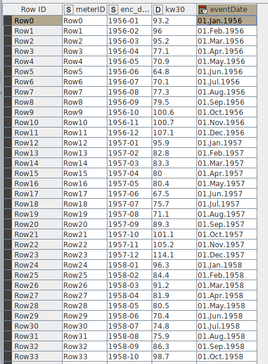
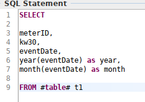
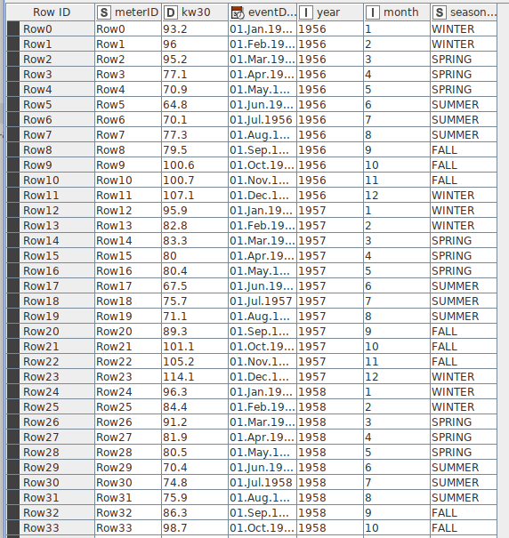
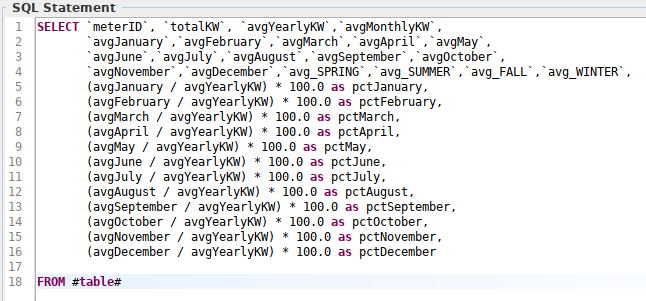
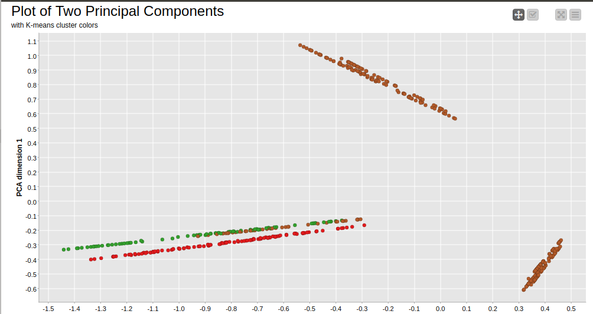

# Monthly Beer Production

Fadhil Musaad

05111740000116

## Business Understanding

Data ini berupa data penggunaan listrik di Irlandia dalam jangka waktu tertentu yang didalamnya terdapat informasi sehingga dapat dilakukan peng-cluster-an dengan tujuan memberikan informasi yang berguna seperti pengurangan konsumsi energi dan sebagainya. 

## Data Understanding

Data ini memiliki 3 kolom yang berisi:
1. MeterID - Berupa integer ID unik tiap meteran yang ada
2. enc_datetime - Berupa integer yang berisi informasi waktu penggunaan
3. reading - Berupa floating point yang berisi informasi penggunaan KWh pada MeterID dan waktu tertentu 

## Data Preparation

Data yang disediakan sudah terdapat dalam workflow. 

## Modeling

- Unduh [workflow](https://hub.knime.com/knime/spaces/Examples/latest/10_Big_Data/02_Spark_Executor/09_Big_Data_Irish_Meter_on_Spark_only)-nya terlebih dahulu

### General Workflow
1. Pertama-tama data akan dibaca oleh node File Reader
2. Lalu kita menyiapkan Local Big Data Environment-nya
3. Masukkan data dari File Reader ke metanode Load Data
4. Metanode Load Data memiliki node seperti berikut

5. Dapat dilihat bahwa metanode load data membuat table pada Local Big Data Environment menggunakan node DB Table Creator lalu mengisi data pada HDFS dan Hive dengan inputan tadi dan meneruskan datanya
6. Setelah itu data tersebut di masukkan kedalam Spark Context menggunakan node Hive to Spark
7. Data diteruskan ke metanode Extract date-time attributes
8. Metanode Extract date-time attributes memiliki node seperti berikut

9. Metanode tersebut menerima inputan data dan mengkonversi enc_datetime tadi menjadi eventDate (Tanggal) dan myTime(Jam) pada node Spark SQL Query dengan syntax dan hasil sebagai berikut

10. Lalu data yang sudah di konversi, di ekstrak jam, hari, minggu, bulan dan tahunnya pada node Spark SQL Query dengan syntax dan hasil sebagai berikut 

11. Lalu data tersebut di klasifikasi berdasarkan weekend atau tidaknya pada node Spark SQL Query dengan syntax dan hasil sebagai berikut 

12. Lalu data yang sudah di klasifikasi tadi di klasifikasikan lagi berdasarkan range-range jam tertentu pada node SQL Spark Query dan meneruskan datanya kembali ke general workflow dengan syntax dan hasil sebagai berikut 

13. Kemudian data tersebut diteruskan ke metanode Aggregations and time series 
14. Metanode tersebut memiliki node sebagai berikut

15. Metanode tersebut mnerima input dan menyimpannya didalam memory sementara menggunakan node Persist Spark Dataframe/RDD
16. Lalu data tersebut dihitung rata-ratanya per segment yang sesuai (tahun, bulan, hari, dsb..) menggunakan maksimal 3 node yaitu Spark GroupBy, Spark Pivot dan Spark Column Rename 
17. Setelah itu, data rata-rata tersebut dijoin menggunakan node Spark Joiner dan diteruskan ke general workflow
18. Selanjutnya, data tersebut dihitung persentase nya per minggu / hari sesuai dengan segmentnya, misalkan segmentnya adalah jam, maka dihitung per hari, misalkan segmentnya hari, maka dihitung per minggu menggunakan node SQL Spark Query dengan syntax dan hasil sebagai berikut 

19. Selanjutnya, data di teruskan menuju komponen PCA, K-Means, Scatter Plot
20. Komponen tersebut memiliki node sebagai berikut

21. Dapat dilihat pada node Normalizer, semua data kecuali ID dinormalisasi menjadi range 0 - 1
22. Pada node setelah Denormalizer data dioutputkan menjadi 2 bentuk yaitu visualisasi dan data table yang diteruskan ke general workflow
23. Selanjutnya, data output tadi dimasukkan kembali ke Local Big Data Environment menggunakan 2 node, yaitu Spark to Hive untuk load menjadi Apache Hive dan Spark to Parquet untuk load menjadi HDFS

## Deployment
### Interactive View
Untuk mengakses interactive view, cukup melakukan klik kanan pada component PCA, K-Means, Plot Scatter dan pilih Interactive View. Hasilnya sebagai berikut 

### Apache Hive
Untuk mengakses DB pada apache hive kita dapat melakukan langkah-langkah sebagai berikut
1. Buka DBeaver
2. Setelah itu lakukan konfigurasi koneksi dengan Apache Hive menggunakan port sesuai pada local big data environment. Disini portnya adalah 43287 

3. Lalu buka SQL Editor
4. Untuk melihat table nya gunakan perintah `show tables`

5. Untuk melihat data aggregasi gunakan perintah `select * from metricaggs`

