# Tugas 1

Fadhil Musaad

05111740000116

## Dataset

Review product rating oleh The Ramen Rater, website untuk penggila ramen dengan lebih dari 2500 review

https://www.kaggle.com/residentmario/ramen-ratings/data

## Business Understanding

Dengan data ini, kita dapat memperoleh:
    * Bahan atau rasa ramen apa yang paling sering terlihat di pasaran.
    * Bagaimana distribusi produk ramen di setiap negara.
    * Brand ramen mana yang paling diminati masyarakat internasional.

## Data Understanding

Data ini memiliki 7 kolom dan 2580 Baris

Kolomnya berisi:

### 1. Review Number

Berisi data integer yang menunjukkan nomor review produk

### 2. Brand

Berisi data string yang menunjukkan merk produk

### 3. Variety

Berisi data string yang menunjukkan rasa / varietas produk

### 4. Style

Berisi data string yang menunjukkan kemasan / penyajian produk

### 5.Country

Berisi data string yang menunjukkan negara dimana produk tersebut terdistribusi

### 6. Stars

Berisi data floating number yang menunjukkan rating produk

### 7. Top Ten

Berisi data string atau null yang menunjukkan apakah produk tersebut masuk dalam 10 besar ramen terbaik pada tahun tertentu

## Data Preparation

1. Untuk splitting pertama-tama file csv dibagi menjadi 2, sesuai dengan kolom-kolomnya
2. Lalu lakukan import salah satunya ke databse

## Modeling

1. Masukkan 2 node connector
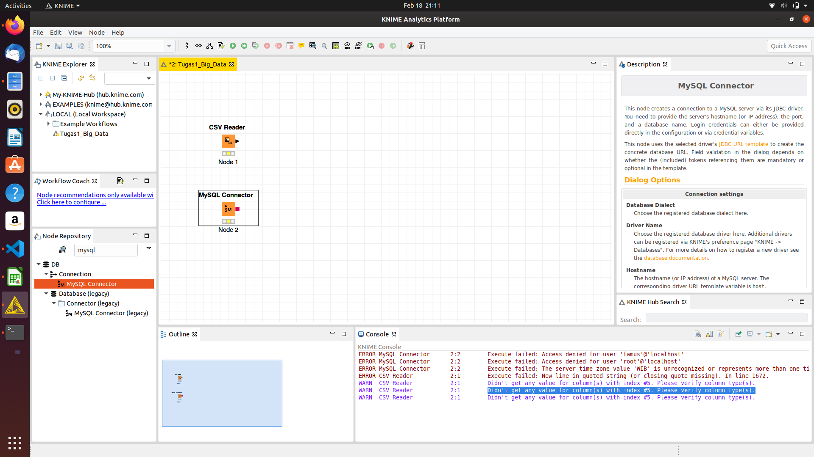
2. Lakukan configure pada DB Connector dan tekan OK lalu execute
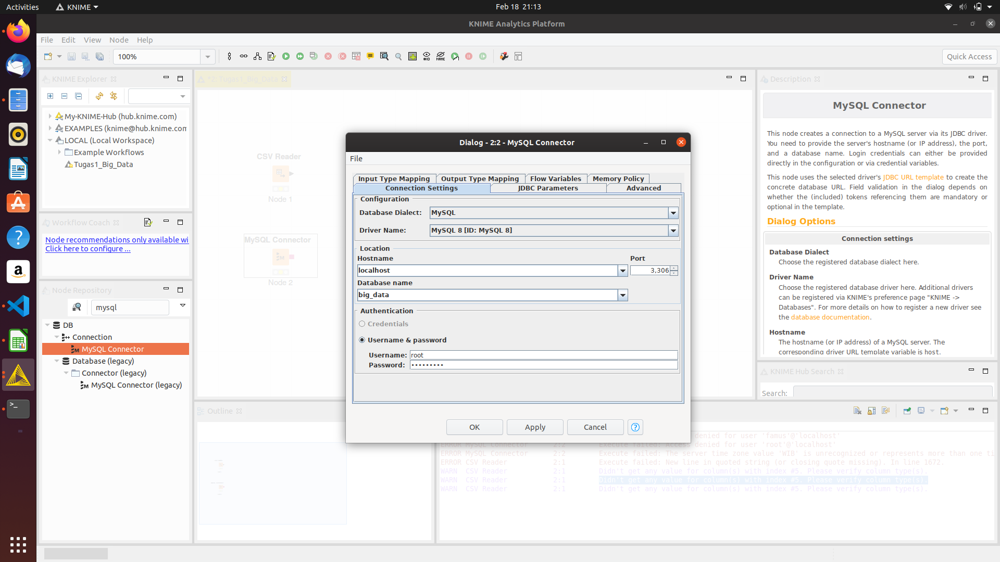
3. Lakukan configure pada File Reader dan tekan OK lalu execute
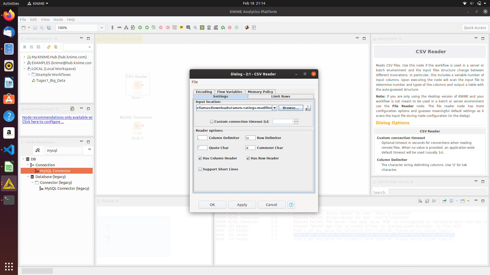
4. Masukkan node table selector, klik configure dan pilih table yang sesuai. setelah itu hubungkan dengan DB connector.
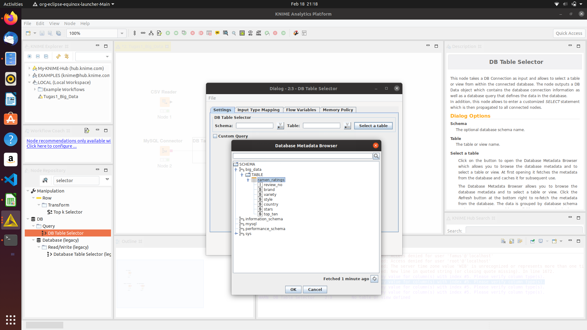
5. Lalu masukkan node DB Reader dan hubungkan dengan table selector.
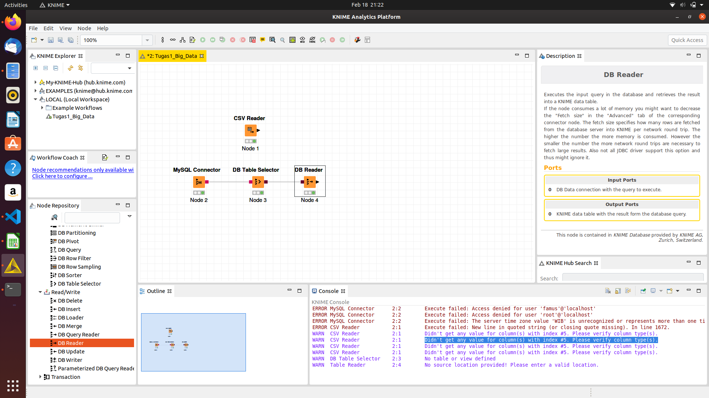
6. Masukkan Node Row ID untuk mengubah primary key pada DB.
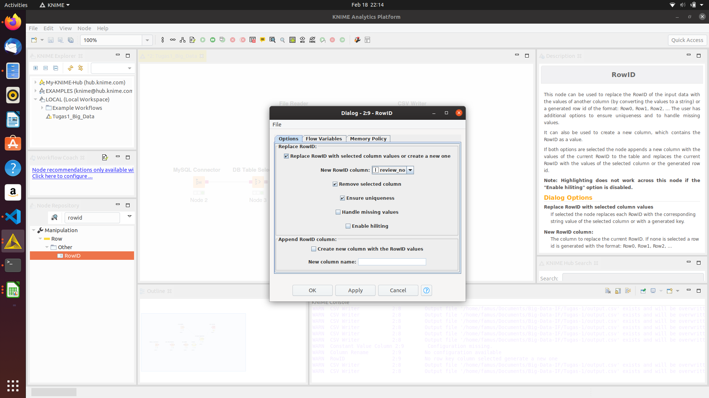
6. Lalu masukkan node Appender dan Hubungkan appender dengan DB reader dan File reader
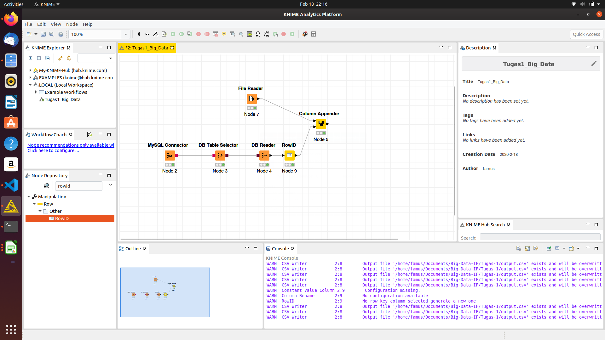

## Deployment

1. Untuk output ke CSV, cukup menggunakan node CSV writer
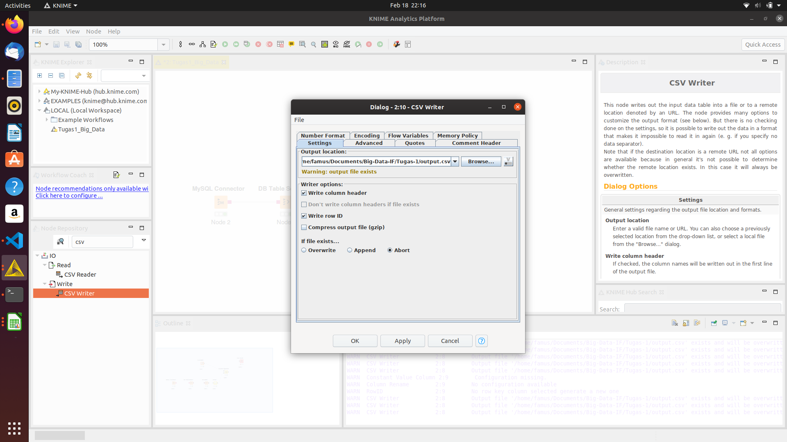
2. Untuk output ke DB, bisa menggunakan DB Writer
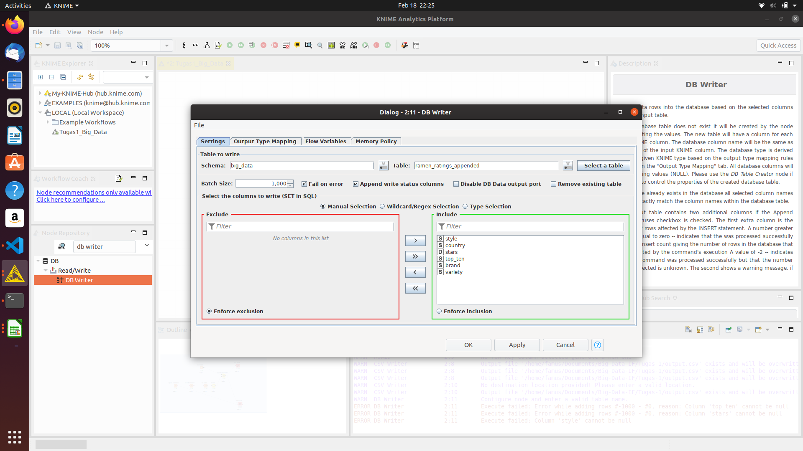
3. Hasilnya akan terlihat seperti berikut pada workflow nya
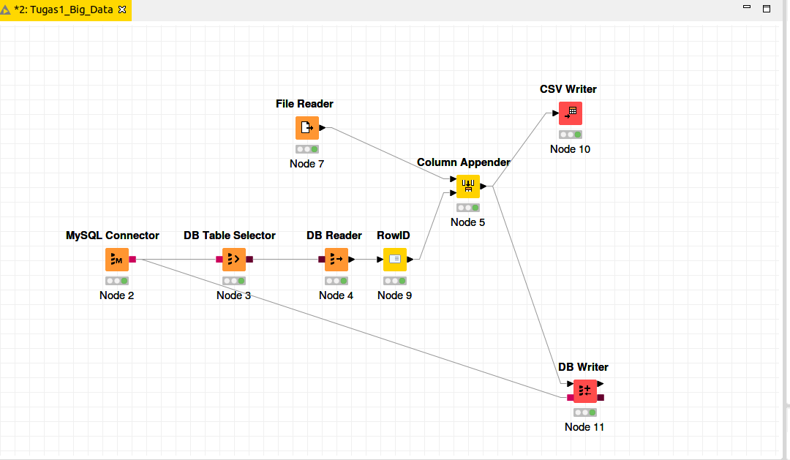
4. Pada DB akan terlihat seperti berikut
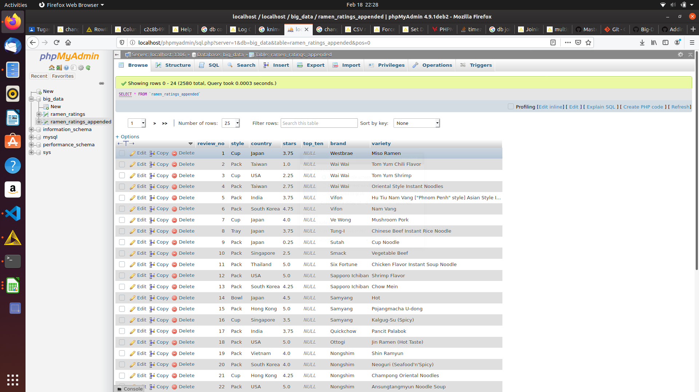
5. Dan pada output.csv akan terlihat seperti beriktu
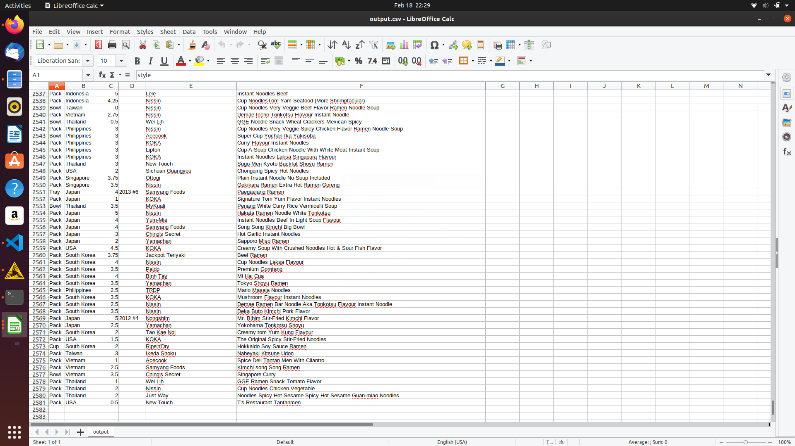