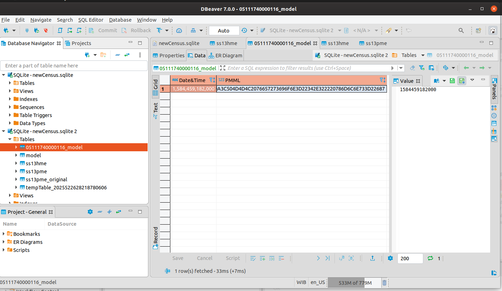

# Tugas 2

Fadhil Musaad

05111740000116

## DB

### DB Connect

1. Masukkan SQLite connector, DB table selector dan DB Reader.
2. Configure newCensus.sqlite pada connector dan select all pada selector dan klik execute pada end node.

3. Klik kanan pada DB Reader dan pilih KNIME Data table.

### In DB Processing

1. Masukkan node-node nya hingga menjadi workflow seperti ini dan klik execute pada end node.

2. Klik kanan pada DB reader dan pilih KNIME data table
3. Pada data 3, tidak ada hasil yang diquery

### Modelling

1. Masukkan node-node nya hingga menjadi workflow seperti ini dan klik execute pada end node.

2. Untuk melihat hasil decision tree nya, klik kanan pada predictor dan view decision tree.

### Writing to DB

1. Masukkan node-node nya hingga menjadi workflow seperti ini dan klik execute pada end node.

2. Cek pada DBeaver file sqlite nya

## Hadoop

### Setup Hive Table

1. Cukup jalankan workflownya dan klik execute pada end node.

2. Buka DBeaver dan lakukan navigasi ke table yang diinginkan.
!