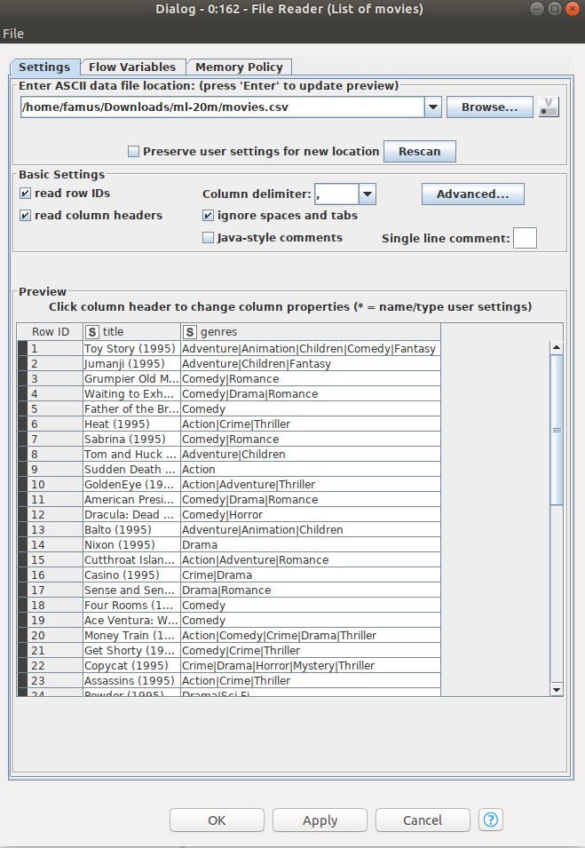
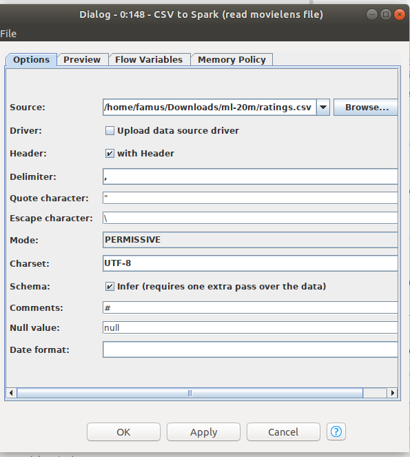

# Tugas 3

Fadhil Musaad

05111740000116

## Business Understanding

Dengan data ini kita dapat menentukan prediksi rekomendasi film yang menarik berdasarkan preferensi dari banyak pengguna

## Data Understanding

Dataset didapatkan dari [MovieLens](https://grouplens.org/datasets/movielens/) yaitu MovieLens 20M dataset dengan struktur:
1. User id - yang digunakan pada ratings.csv dan tags.csv
2. Movie id - Hanya film yang memiliki minimal 1 rating atau tag yang dimasukkand dalam dataset yang id nya akan digunakan dalam pemrosesan
3. Rating Data file Structure - dimana ratings.csv memiliki format: userId,movieId,rating,timestamp.
4. Tags Data file Structure - dimana tags.csv memiliki format: userId,movieId,tag,timestamp.
5. Movie Data file Structure - dimana movies.csv memiliki format: movieId,title,genres
6. Links Data file Structure - dimana links.csv memiliki format: movieId,imdbId,tmdbId
7. Tag Genome Data file Structure - dimana genome-scores.csv dan genome-tags.csv memiliki format:movieId,imdbId,tmdbId

## Data Preparation

Data yang didapatkan dari movielens sudah sesuai format nya dengan workflow sehingga hanya perlu mengganti file path menuju file movies.csv

Begitu juga pada node CSV to Spark, hanya perlu mengganti source path menuju file rating.csv

Rate movie pada node "Ask User for Movie Rating".

Pada node Top 20 Recommendation browse source path menuju file movie.csv

## Modeling

Kita perlu mengunduh [Workflow](https://hub.knime.com/knime/spaces/Examples/latest/10_Big_Data/02_Spark_Executor/10_Recommendation_Engine_w_Spark_Collaborative_Filtering)nya terlebih dahulu.

## Deployment

Untuk melihat ketelitian cukup melakukan view pada node Numeric Scorer

Untuk melihat hasil rekomendasi cukup view pada node Display Recommendation

## Compare Study

Disebutkan bahwa penggunaan File Reader akan memakan waktu lebih lama dibanding menggunakan CSV to Spark. Disini akan dibuktikan kebenarannya.
Untuk mencari perbandingannya, dapat dilakukan menggunakan langkah sebagai berikut:
1. Masukkan node Create local big data env
2. Masukkan node Java edit variable untuk mencari starting time dengan syntax sebagai berikut:

3. Masukkan 2 node java edit variable untuk mencari ending time pada proses yang akan di bandingkan, dalam kasus ini, file reader dan CSV to Spark.

4. Masukkan node CSV to Spark, File Reader dan Table to Spark kedalam workflow
5. Setelah, itu hubungkan hingga menjadi seperti berikut.

6. Dapat, dilihat setelah melakukan excecute all. File reader masih membaca file sedangkan CSV to Spark telah selesai.

