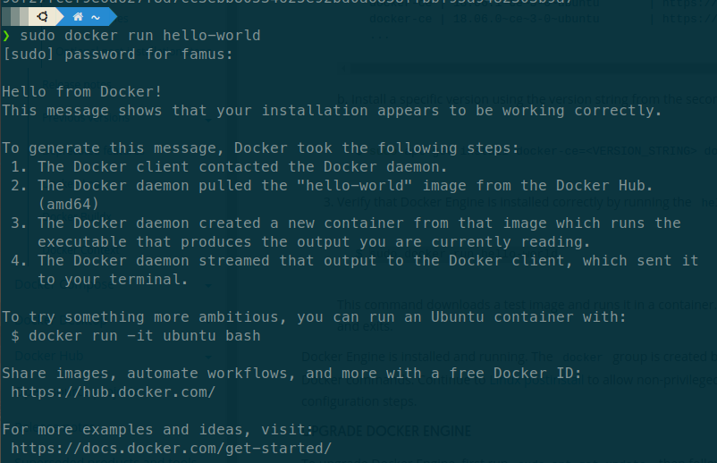
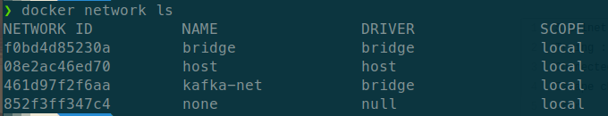
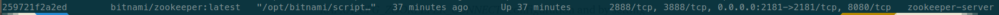
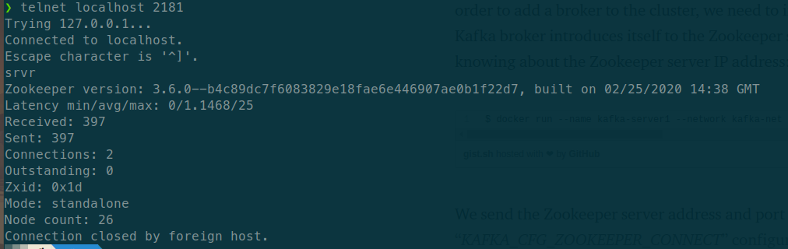
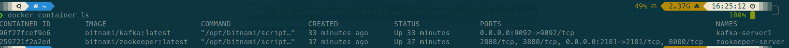
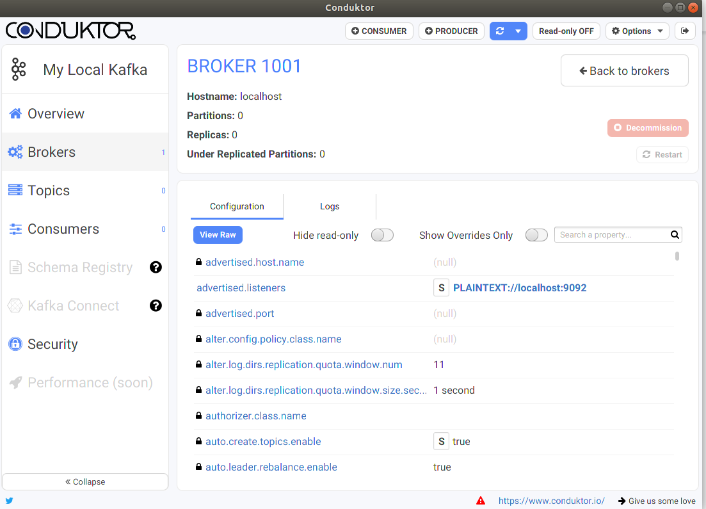

# Tugas 3

Fadhil Musaad

05111740000116

Implementasi Infrastruktur Kafka menggunakan Docker

## Tahapan
1. Lakukan instalasi docker engine pada environment yang tersedia. Disini saya menggunakan Linux [Ubuntu](https://docs.docker.com/engine/install/ubuntu/) 
2. Lakukan langkah-langkah diatas dan jalankan command `sudo docker run hello-world`. Jika berhasil akan muncul seperti ini 
3. Untuk mempermudah akses pada docker, lakukan langkah pada link ini untuk mengubah permissionnya [Link](https://docs.docker.com/engine/install/linux-postinstall/)
4. Langkah pertama untuk mendeploy adalah dengan membangun docker network dengan command `docker network create kafka-net --driver bridge`. Untuk mengecek network dapat mengetikkan command `docker network ls` 
5. Selanjutnya lakukan command `docker run -d --name zookeeper-server -p 2181:2181 --network kafka-net -e ALLOW_ANONYMOUS_LOGIN=yes bitnami/zookeeper:latest` untuk mendownload image zookeper
6. Lalu untuk mengetest zookeper, periksa port running pada zookeper dengan menggunakan command `docker container ls`. Lalu lakukan command `telnet {IP} {PORT}` dan masukkan command `srvr` 
7. Lalu untuk menginstall kafka lakukan command `docker run -d --name kafka-server1 --network kafka-net -e ALLOW_PLAINTEXT_LISTENER=yes -e KAFKA_CFG_ZOOKEEPER_CONNECT=zookeeper-server:2181 -e KAFKA_CFG_ADVERTISED_LISTENERS=PLAINTEXT://localhost:9092 -p 9092:9092 bitnami/kafka:latest`
8. Untuk mengecek semua container yang running lakukan command `docker container ls`  
9. Selanjutnya jalankan Conduktor. Jika benar, maka seharusnya tampilan Conduktor seperti ini  
