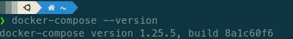
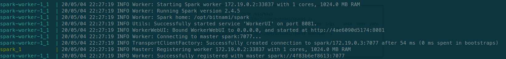
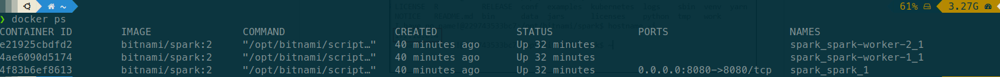
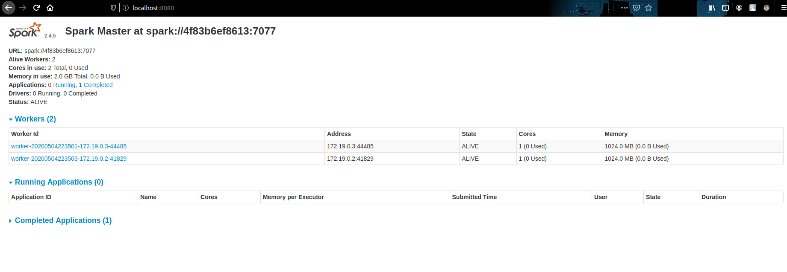
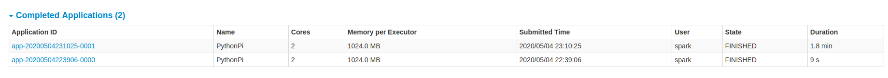
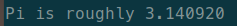
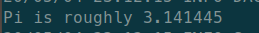
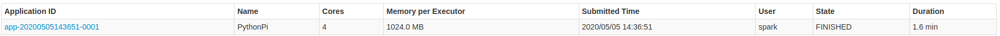
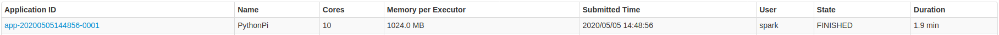

# Tugas 5

## Fadhil Musaad
## 05111740000116

# Apache Spark Cluster menggunakan Docker

## Tahapan

### Instalasi Docker Compose
1. Instalasi docker-compose menggunakan `sudo curl -L "https://github.com/docker/compose/releases/download/1.25.5/docker-compose-$(uname -s)-$(uname -m)" -o /usr/local/bin/docker-compose`
2. Buat permission pada docker-compose dengan command `sudo chmod +x /usr/local/bin/docker-compose`
3. Periksa versi docker-compose menggunakan command `docker-compose --version` akan terlihat seperti berikut 

### Membuat Apache Spark Cluster
1. Download file docker compose dengan command `wget https://raw.githubusercontent.com/bitnami/bitnami-docker-spark/master/docker-compose.yml`
2. lalu jalankan perintah `docker-compose up` untuk membuat container
3. Tunggu hingga proses selesai 
4. Periksa daftar container menggunakan command `docker ps` 
5. Test Spark Cluster dengan mengakses http://localhost:8080 pada browser 

### Menjalankan Script Python pada Apache Spark Cluster
1. Lakukan perintah `docker exec -it <id-container-master> /bin/bash`
2. Periksa alamat ip menggunakan `hostname -i`
3. Submit job dengan menggunakan command `spark-submit --master spark://<alamat-ip>:<port> <source-file> <jumlah-partisi>`

### Mencoba dengan Parameter yang Lebih Besar
1. Lakukan submit job dengan jumlah partisi 1000
2. Bandingkan Completed Applications pada web browser 
Untuk 10 Partisi:

Untuk 1000 Partisi:

### Percoban dengan Paramter yang Berbeda
1. 
2. 
3. 
4. 
5. 
6. 
7. 
8. 

### Tabel Keterangan Percobaan
| # | Worker | CPU / Worker | Partition | Pi Value |  Time  | Absolute Error |
|:-:|:------:|:------------:|:---------:|:--------:|:------:|:--------------:|
| 1 |    2   |       2      |    100    | 3.140480 |   18s  |    0.001112    |
| 2 |    2   |       2      |    1000   | 3.146986 | 1.6min |    0.005394    |
| 3 |    2   |       4      |    100    | 3.140860 |   17s  |    0.000732    |
| 4 |    2   |       4      |    1000   | 3.139739 | 1.5min |    0.001853    |
| 5 |    5   |       2      |    100    | 3.143507 |   27s  |    0.001915    |
| 6 |    5   |       2      |    1000   | 3.142581 | 1.9min |    0.000989    |
| 7 |    5   |       4      |    100    | 3.139816 |   25s  |    0.001776    |
| 8 |    5   |       4      |    1000   | 3.141724 | 1.9min |    0.000132    |
