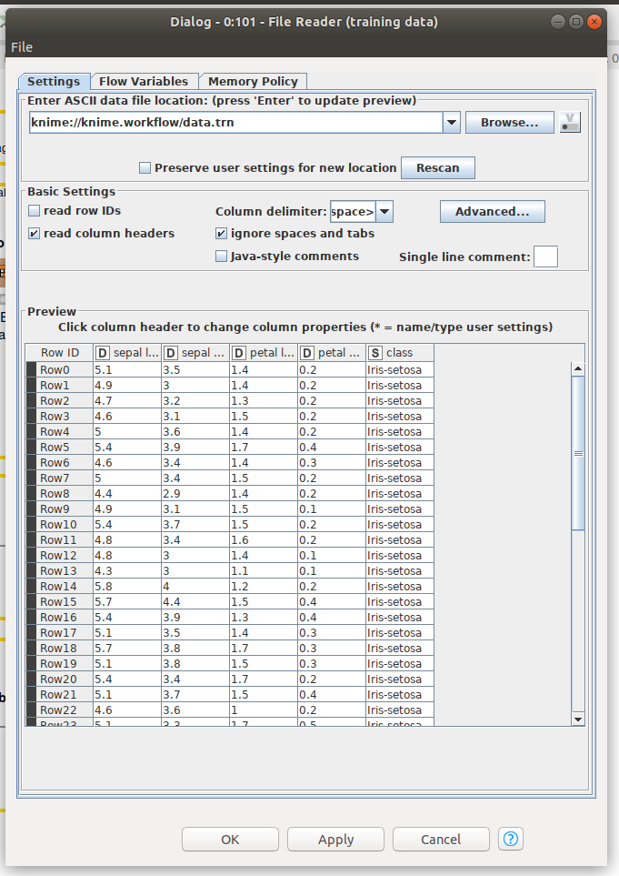
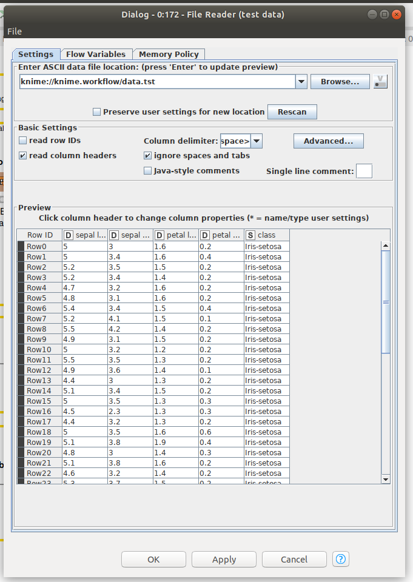
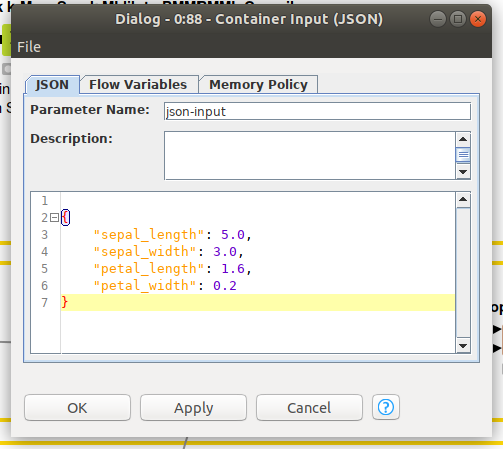
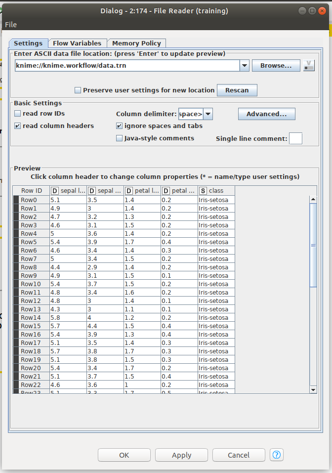
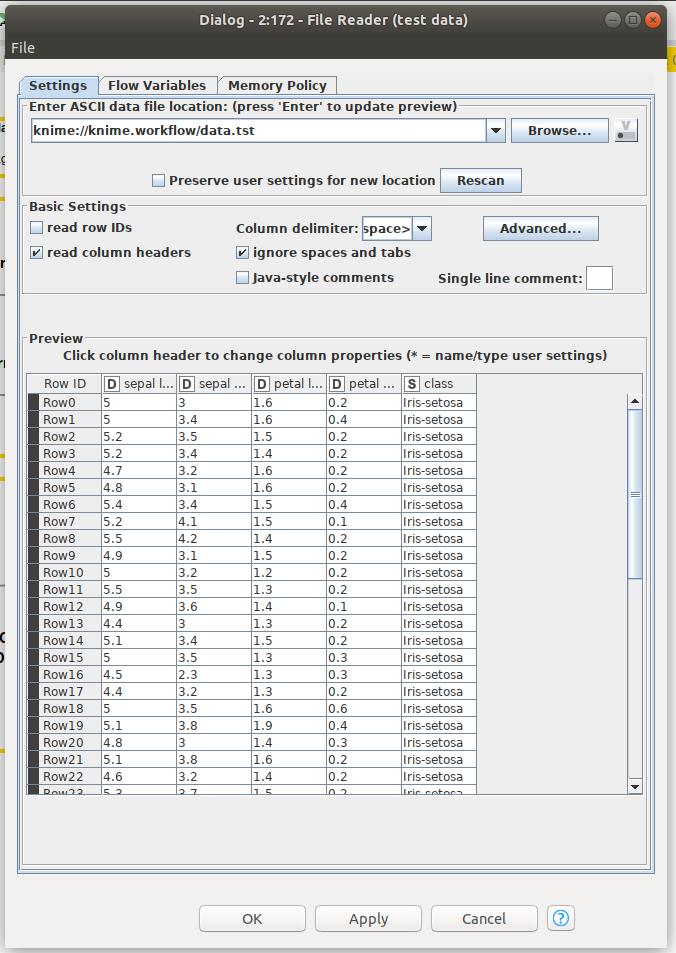
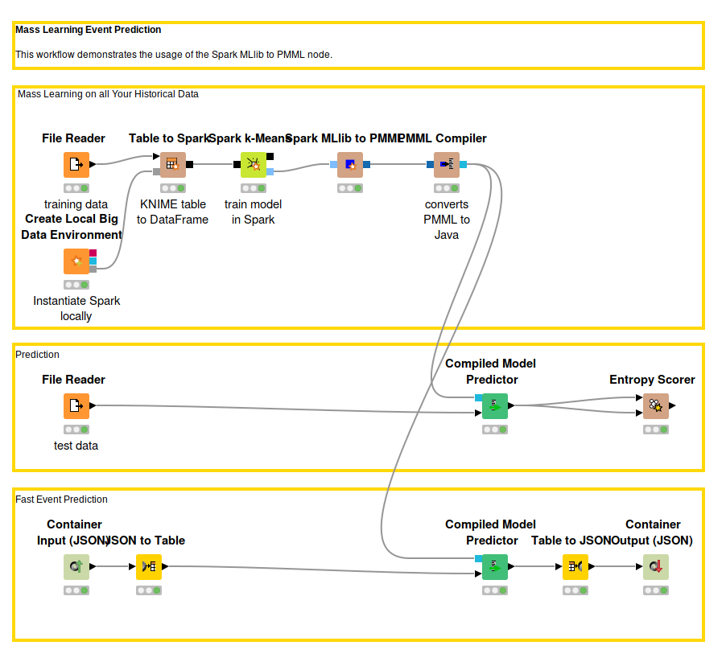
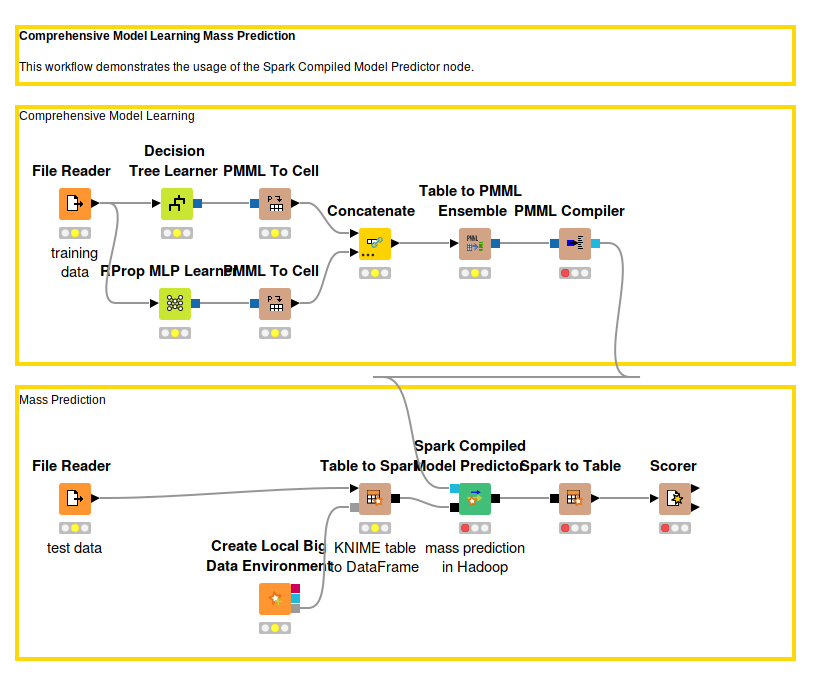
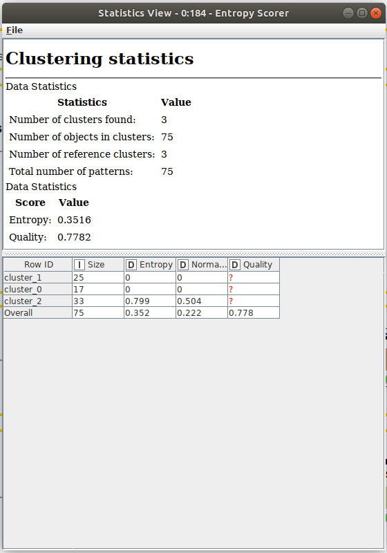
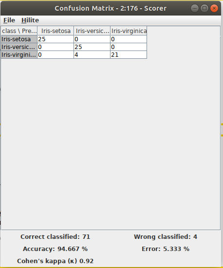
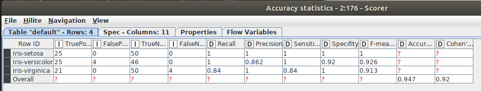

# Tugas 6

Fadhil Musaad

05111740000116

## Business Understanding

Dengan data ini kita dapat memprediksi jenis bunga dan menempatkannya pada cluster yang sesuai

## Data Understanding

Dataset adalah Iris Flower Dataset dengan properti sebagai berikut.
1. Sepal Length - Berupa floating point
2. Sepal Width - Berupa floating point
3. Petal Lenght - Berupa floating point
4. Petal Width - Berupa floating point
5. Class - Berupa string dengan value "Iris-setosa", "Iris-virginica" atau "Iris-versicolor"

## Data Preparation

Data yang disediakan sudah terdapat dalam workflow.

### Mass Learning Event Prediction Data

- Training data   
- Test Data   
- Input Data  

### Comprehensive Model Learning Mass Prediction Data

- Training data  
- Test Data  

## Modeling

### Mass Learning Event Prediction Model

- Unduh [workflow](https://hub.knime.com/knime/spaces/Examples/latest/10_Big_Data/02_Spark_Executor/02_Mass_Learning_Event_Prediction_MLlib_to_PMML)-nya terlebih dahulu

### Comprehensive Model Learning Mass Prediction Model

- Unduh [workflow](https://hub.knime.com/knime/spaces/Examples/latest/10_Big_Data/02_Spark_Executor/03_PMML_to_Spark_Comprehensive_Mode_Learning_Mass_Prediction)-nya terlebih dahulu

## Deployment

### Mass Learning Event Prediction

- Untuk melihat statistik clustering cukup melakukan statistic view pada node Entropy Scorer 
- Untuk melihat hasil prediksi cukup melakukn view JSON snapshot pada node Containter Output (JSON) 

### Comprehensive Model Learning Mass Prediction Data

- Untuk melihat Confusion Matrix cukup melihat View Confusion Matrix pada node Scorer 
- Untuk melihat Accuracy Statistic dapat dilihat pada table Accuracy statistics pada node Scorer 
